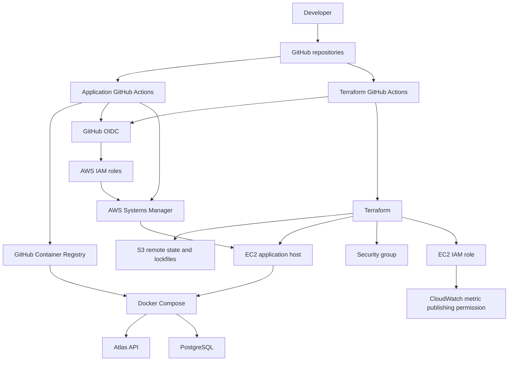

# Atlas infrastructure

This repository contains the Terraform configuration and GitHub Actions workflows that manage the AWS infrastructure for [Atlas](https://github.com/MohameddMostafaa/atlas), a service-status and incident-management application. Application source code, container build, API tests, and application deployment workflow live in the separate `atlas` repository.

## Overview

Atlas currently uses a deliberately small AWS footprint: one EC2 host runs Docker Compose, which hosts the Atlas API and PostgreSQL. Terraform keeps the infrastructure configuration version-controlled, while GitHub Actions uses short-lived GitHub OIDC credentials rather than stored AWS access keys.

This is a portfolio v1 architecture. It demonstrates repeatable provisioning, IAM, remote state, and deployment automation without claiming high availability or a managed-database design.

## Architecture



## Components

| Component | What it does | Why it is used |
| --- | --- | --- |
| EC2 | Hosts the current Atlas Docker Compose deployment. | A simple, understandable deployment target for the project’s present scale. |
| Security group | Allows public HTTP access and permits outbound traffic. | Provides the host-level network boundary without opening SSH. |
| EC2 IAM role | Grants SSM managed-instance access and permission to publish metrics in the Atlas CloudWatch namespace. | Allows AWS-integrated administration without credentials on the host. |
| GitHub OIDC roles | Allow the application and infrastructure workflows to assume constrained AWS roles. | Avoids long-lived AWS credentials in GitHub secrets. |
| SSM | Receives application deployment commands from the application workflow. | Supports remote deployment and administration without SSH ingress. |
| S3 backend | Stores Terraform state remotely. | Keeps shared state out of local machines and source control. |
| S3 lockfiles | Coordinates access to the remote Terraform state. | Reduces concurrent state-write risk. |
| GitHub Actions | Runs Terraform checks and applies approved main-branch changes. | Makes infrastructure changes reviewable and repeatable. |

The CloudWatch policy is permission-only in this repository: no metric publisher, alarms, or dashboard resources are defined here.

## Why this architecture?

| Decision | Reason |
| --- | --- |
| EC2 | Fits a small portfolio application while keeping Linux, networking, and deployment concerns visible. |
| Docker Compose | Runs the API and PostgreSQL together with a reproducible host configuration. |
| Terraform | Defines infrastructure as reviewable, version-controlled configuration. |
| GitHub OIDC | Uses short-lived workflow credentials instead of static AWS keys. |
| S3 remote state | Centralizes Terraform state and keeps it out of Git. |
| SSM | Enables deployment without a public SSH rule. |
| Immutable image tags | The application workflow deploys a specific container build and can roll back to its previous image. |
| `prevent_destroy` on EC2 | Protects the existing host from accidental destruction during Terraform changes. |

## Repository structure

```text
main.tf             Terraform backend, provider, and required provider version
variables.tf        Deployment inputs and defaults
network.tf          Existing VPC and subnet data sources
security-group.tf   HTTP ingress and outbound network rules
ec2.tf              Atlas EC2 instance and lifecycle protection
iam.tf              EC2, deployment, and Terraform GitHub OIDC roles/policies
outputs.tf          Instance, security-group, and role outputs
.github/workflows/  Terraform plan and apply workflows
.terraform.lock.hcl Provider dependency lockfile
```

## CI/CD

### Infrastructure workflow

`.github/workflows/terraform.yml` runs on pull requests that change Terraform, the lockfile, or that workflow. It performs:

1. `terraform fmt -check -recursive`
2. AWS authentication through the Terraform GitHub OIDC role
3. `terraform init`
4. `terraform validate`
5. `terraform plan`

`.github/workflows/terraform-apply.yml` runs on pushes to `main`. It authenticates through the same OIDC model, initializes and validates Terraform, then applies the configuration.

### Application deployment relationship

The separate application repository builds an immutable backend image, publishes it to GHCR, assumes its deployment IAM role through OIDC, and sends an SSM command to the EC2 host. The host pulls the requested image and deploys it with Docker Compose. This repository provides the EC2, IAM, SSM access, and network boundary that make that flow possible.

## State management

Terraform state is configured in an S3 backend with S3 lockfiles. The concrete bucket name and state key are intentionally not repeated in this README.

Remote state is useful because it gives the team and CI workflow one source of truth. Terraform state can contain infrastructure metadata and must not be committed; `.gitignore` excludes `.terraform/`, `*.tfstate`, backups, crash logs, and local `terraform.tfvars`. The provider lockfile is intentionally committed so provider resolution stays reproducible.

## Security considerations

- GitHub Actions uses OIDC roles rather than committed AWS access keys.
- The EC2 host uses an IAM role for SSM and restricted CloudWatch metric publishing.
- No SSH ingress rule is defined; SSM is the intended administrative path.
- The deployment role is scoped to SSM deployment actions, while the Terraform role is constrained to the resources/state it manages.
- EC2 lifecycle protection reduces accidental deletion risk.

Current limitations are deliberate to keep v1 small:

- HTTP is publicly exposed; TLS/HTTPS is not configured here.
- There is one EC2 host and one PostgreSQL container, with no high-availability or backup resources.
- Outbound security-group access is broad.
- The apply workflow uses `terraform apply -auto-approve` after a `main` push, so branch protection and pull-request plan review are important safeguards.
- Some existing environment identifiers and deployment resource references are intentionally fixed to the current AWS environment; do not rename or replace them casually.

## Operations

Run these commands from the repository root after configuring AWS access appropriate to the environment:

```bash
terraform init
terraform fmt -check -recursive
terraform validate
terraform plan
```

Review the plan carefully before applying. For intentional, reviewed infrastructure changes only:

```bash
terraform apply
```

Inspect managed resource values with:

```bash
terraform output
```

Do not commit `terraform.tfvars`, state files, or local `.terraform/` data. Do not remove the EC2 lifecycle protection simply to make a replacement easier; first understand the impact on the live application host.

## Application repository

The Atlas application repository is [github.com/MohameddMostafaa/atlas](https://github.com/MohameddMostafaa/atlas). It contains the FastAPI backend, React frontend, Docker image and Compose files, database migrations, application CI/CD workflow, and deployment script.
